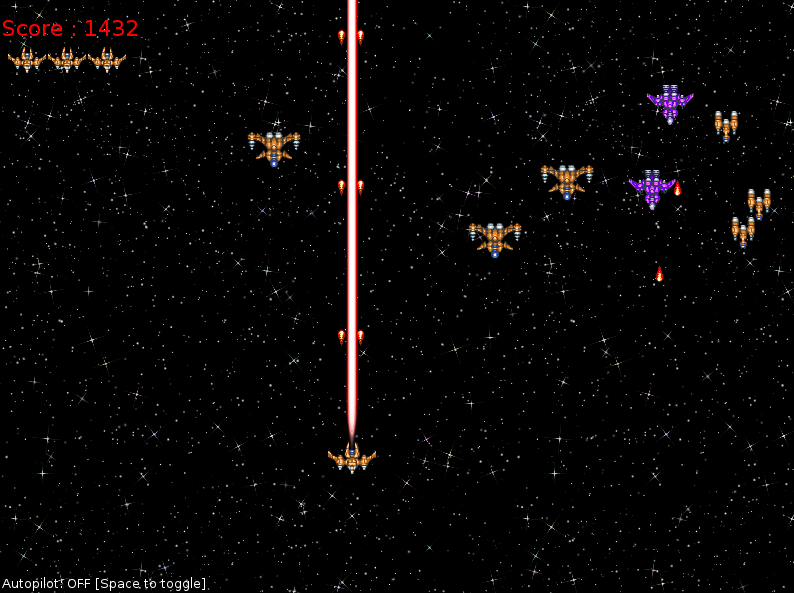

# wave1608
Space shooter game written in c using allegro library
====20.08.2017====

allegro-5.0.10-mingw-4.7.0
CodeBlocks 16.01 GNU GCC Compiler

  
    

    
  

Credits

IMAGES 
https://opengameart.org/content/lightning
https://opengameart.org/content/2d-spaceship-sprites-with-engines
https://opengameart.org/content/missile

GAME MUSIC
https://www.youtube.com/watch?v=EF_8ZFSxgyQ

MENU MUSIC
https://www.youtube.com/watch?v=rNrO0A0SsGg
